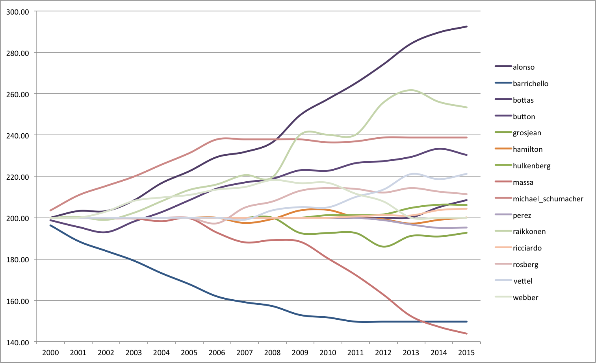

# F1 Ranking

Just a quick experiment to try applying rating systems like Elo on the F1 drivers. More for stretching my F# programming legs than for the data science (I'm sure after getting and preparing the data this could all have been done with a spreadsheet).

The data is from the excellent [Ergast](http://ergast.com) API.

## Method 

- For each race where neither driver in a team had a mechanical failure, score as:
  1 - positionA / (positionA + positionB)
- Collect average scores for each driver for each season
- Update the driver's Elo rating after each season

## Results

Here's a graph of selected drivers. Alonso is just incredible! Puts a dent in the rating of anyone coming up against him. Poor Massa.

Some interesting results: Raikkonen does rather well (until Alonso hits) whereas Hamilton actually comes off as pretty average. Maybe this indicates an error in the scoring (see potential issues below).

Full data is in a [spreadsheet](./f1_elo_ratings.xlsx).

## Potential issues

- Didn't consider results before 2000, but should because Schumacher started before then.
- Have not experimented with K-factor or initial score at all.
- Doesn't take into account non-race-terminating mechanical failures.
- Places collision blame on both drivers, which will unfairly affect victims (although serial victims should be less common than serial offenders).
